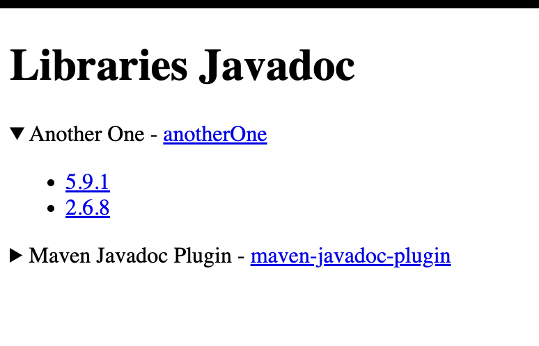

# UI Javadoc for Libraries
This UI provides access to the Javadoc of some libraries, see image below.

The UI provides a list of some Javadocs and give access to view them through the UI.

### Development
To add a new Javadoc of a Library to the UI, e.g. **maven-javadoc-plugin-2.8.1-javadoc.jar**:
- <u>unzip</u> the corresponding JAR file into the directory appropriate directory, directory format: 
*src/main/resources/static/javadoc/&lt;lib_name&gt;/&lt;lib_version&gt;*.
Where &lt;lib_name&gt; refers to the name of the library, e.g. **maven-javadoc-plugin**, and &lt;lib_version&gt; to its version, e.g. **2.8.1**.
- <u>test</u> it
- <u>commit</u> it to repository
- <u>build</u>
- <u>deploy</u>

### Reference Documentation
For further reference, please consider the following sections:

* [Official Gradle documentation](https://docs.gradle.org)
* [Spring Boot Gradle Plugin Reference Guide](https://docs.spring.io/spring-boot/docs/2.7.10/gradle-plugin/reference/html/)
* [Apache Freemarker](https://docs.spring.io/spring-boot/docs/2.7.10/reference/htmlsingle/#web.servlet.spring-mvc.template-engines)
* [Spring Web](https://docs.spring.io/spring-boot/docs/2.7.10/reference/htmlsingle/#web)
